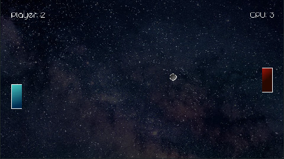

# Pong

Pong clone created with LÖVE/Lua.

## Controls

Keyboard | Joystick | Command
:------- | :------- | :------
`W`/`S` or `UP`/`DOWN` | `UP`/`DOWN` | Move Paddle
`ENTER` | `START` | Start/Pause Game
`F11` | `Y` | Toggle Fullscreen

## Latest Release [v0.2.0]

- [Linux (AppImage)](https://github.com/xerocuil/pong/releases/download/v0.2.0/pong-v0.2.1-linux.AppImage)
- [Linux (tar.gz)](https://github.com/xerocuil/pong/releases/download/v0.2.0/pong-v0.2.1-linux.tar.gz)
- [Windows (64-Bit)](https://github.com/xerocuil/pong/releases/download/v0.2.0/pong-v0.2.1-win.zip)

## To-Do

- [ ] Menu
- [ ] Music
- [ ] Two-Player mode
- [x] Full-screen Support
- [x] Graphics
- [x] Scoreboard
- [x] Sound effects
