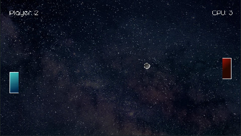

# Pong

Pong clone created with LÖVE/Lua.

## Controls

Command           | Keyboard                            | Joystick
:------           | :-------                            | :-------
Move Paddle       | 1P: `W` / `S` 2P: `UP` / `DOWN` | `D-PAD` or `L STICK`
1 Player Game     | `1`                                 | `A`
2 Player Game     | `2`                                 | `X`
Pause             | `ENTER`                             | `START`
Toggle Fullscreen | `F11`                               | `Y`
Exit Match/Game   | `ESC`                               | `BACK`

## Latest Release [v0.3.0]

- [Linux (tar)](https://github.com/xerocuil/pong/releases/download/v0.3.0/pong-v0.3.0-linux.tar.gz)
- [Windows (64-Bit/zip)](https://github.com/xerocuil/pong/releases/download/v0.3.0/pong-v0.3.0-win.zip)
- [AppImage](https://github.com/xerocuil/pong/releases/download/v0.3.0/pong-v0.3.0-linux.AppImage)
- [LÖVE](https://github.com/xerocuil/pong/releases/download/v0.3.0/pong-v0.3.0.love)

---

[Homepage](https://github.com/xerocuil/pong) | [Changelog](changelog.md)
